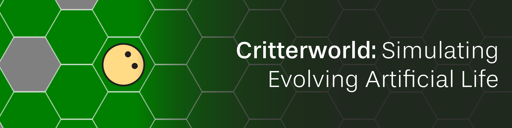
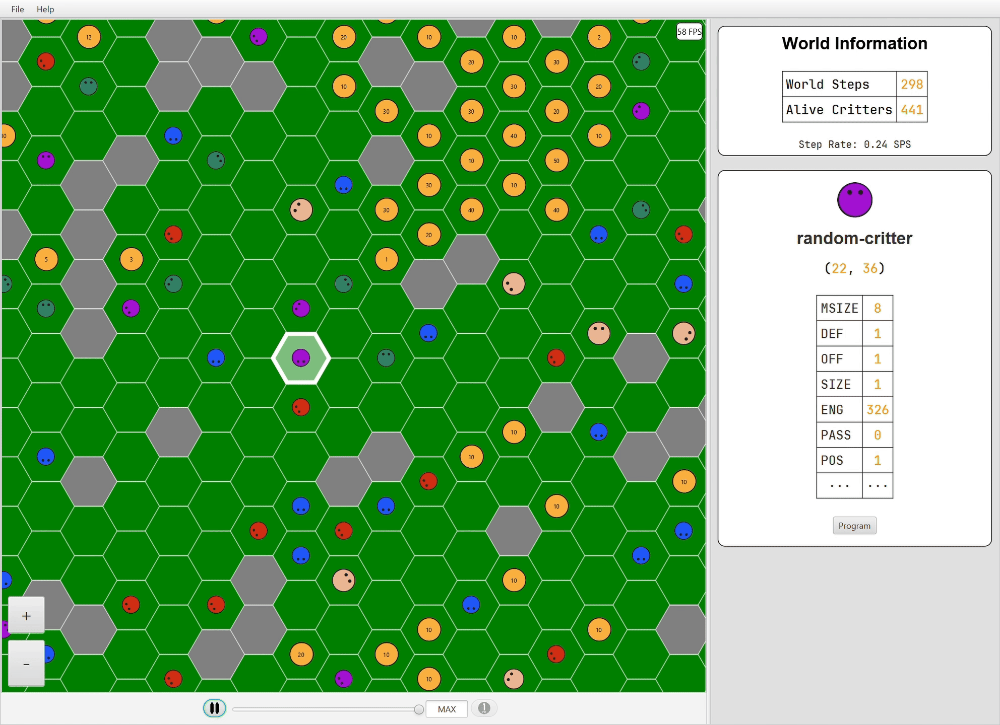

[![Java][java-badge]](https://www.java.com/en/)
[![JavaFX][javafx-badge]](https://openjfx.io/)
[![JUnit][junit-badge]](https://junit.org/junit5/)

Created by **John Karaca**, **Michael Zhang**, **Lichen Huang**, and **Ibrahim Ahmed** for [CS 2112: Object-Oriented Design and Data Structures (Honors)](https://www.cs.cornell.edu/courses/cs2112/2024fa/) at Cornell University

## Overview

**Critterworld** is an artificial life simulation of organisms called critters that move, eat, fight, reproduce, and evolve. These critters exist in a world of hexagon tiles and have genomes that specify their behaviors. As critters reproduce, the genomes of new critters can have mutations — a process that enables evolution over time.

More information about this project is available at the [project specification](https://www.cs.cornell.edu/courses/cs2112/2024fa/project/project.pdf?1732124197).

_**Note:** in accordance with Cornell University's Academic Integrity Policy, we cannot publicly share the code to this project. This page serves as a summary and demonstration of our work._

## Features

### The World
The world that critters live in is a grid of hexagonal tiles called hexes. These hexes either can be occupied by an entity (i.e., a critter or food) or are rocks that an entity cannot reside on. In a world file, users can specify the size of a world and the locations of rocks, food, and critters.

```java
name example-world

// The size (number of columns, number of rows) of the world
size 10 15

// The locations of rocks
rock 2 2
rock 4 6
rock 3 3
rock 7 7

// The locations of food and the amount of energy they each have
food 4 4 500
food 1 3 200

// The locations of critters and their initial direction in the range [0, 6)
critter random-critter.txt 2 6 1
critter random-critter.txt 2 8 4
critter random-critter.txt 4 2 2
```
<p align="center"><b>Figure 1:</b> an example world file with rocks, food, and critters.</p>

### Critter Genomes

The genome of a critter consists of memory that stores attributes of a critter's state — like its defensive ability, offensive ability, and size — and a program that determines what the critter does in each time step. Programs are written according to a context-free grammar that consists of 16 different productions. When a critter is created, its program is parsed into an abstract syntax tree (AST) that it can then traverse to execute the program's rules.

```java
species: random-critter
memsize: 8
defense: 1
offense: 1
size: 1
energy: 500
posture: 1

// Choose a random number in the range [1, 4]
mem[7] = 0 --> mem[7] := random[3] + 1;

// Move forward, move backward, turn left, or turn right
// depending on the chosen number and reset the number
mem[7] = 1 --> mem[7] := 0
               forward;

mem[7] = 2 --> mem[7] := 0
               backward;

mem[7] = 3 --> mem[7] := 0
               left;

mem[7] = 4 --> mem[7] := 0
               right;
```
<p align="center"><b>Figure 2:</b> the genome of a critter that randomly moves every time step.</p>

This grammar allows users to write complex behaviors into critters. Among others, our team has designed critters that reproduce as quickly as possible, locate and traverse to food using the minimum energy possible, and move in a spiral that gets increasingly bigger.


<p align="center"><b>Figure 3:</b> A rocky world with a "forager" critter that locates and traverses to food using the minimum energy possible.</p>

Lastly, when a critter reproduces, there is a 1/4 chance that the new critter's genome will have a mutation(s) that affects either its memory or its program. To mutate a program, the AST representation of a parent's program is copied to its child and then fault injected in 1 of 6 possible ways.

### Graphical User Interface (GUI)

Users can use our JavaFX GUI to initialize, observe, and manipulate the simulation. The top app bar allows users to load in a world and load critters into an already loaded world. The middle section displays the simulation and allows users to pan across it and zoom into it. The right section displays information concerning the simulation's state and additional information when an entity is selected. Finally, the bottom section allows users to advance the simulation manually or automatically and change the simulation's speed.


<p align="center"><b>Figure 4:</b> the GUI of a large world with various critters.</p>

After selecting a critter with their mouse cursor, users can read information about that critter that's updated every time step. This includes the critter's stats (e.g., defense, offense, size), how much energy the critter has left, and which instruction of its program did the critter last execute.


<p align="center"><b>Figure 5:</b> A small world with criters moving randomly. Using the bottom bar, users can adjust the speed of the simulation before and during execution. Additionally, after selecting a critter, users can track the most recent rule it executed.</p>

[java-badge]: https://img.shields.io/badge/-Java-orange?logo=data:image/jpeg;base64,iVBORw0KGgoAAAANSUhEUgAAAC4AAAAuCAYAAABXuSs3AAAACXBIWXMAAAsSAAALEgHS3X78AAAFwUlEQVRogc2ZW2xUVRSGv3Jrh04ZEDrIpRHECqKiAhqvoE1IQ1AUEVOp2gLGFxNetAIiQR+wCvIAEY0ihsobETU8KQEkXkGrohBuRQKoQGotDPdL4fdh7bGnp3PrzAH9k53uOXvvtf6z9tprr7OaJ4krgGLgryAFdgpSWApU19bWFgUp8EoRHw6MD1JglyCFJUFP4GFgX5BCr4TFlwC9gPNBCr3cxOcBT7t+fZCCL5er5AG1wCz3ex+wKVANkoJuhZJWqy0eSzR3yJAhBcXFxZFs9ARNulTSdh/p9zzjPSRVSqqTtFPS4uXLl4f/a+LjJDX7SH8uqaukvpLeknTKPd8v6d5c9AVFukrSeR/pLyWFJU32vdAnknrmqjMI0lMktSQgXShpqqSLnuevS8oLwlg5La6vrx8k6biP9HfO0v18YwuCIBxvucbx5wFvDvIbMAE4CTzjGfsZeDlHXW2QK/FRnr6wy6bZ/b7bM/aTGw8MuRJv8vS/dS2Orp7+XTnqaYdcia/19P/wjX3l6Q8HJuWoqy1yPJz5kva4w9coqcAz3kdSk+dwNshieiCHMwgh90m64MhN841N9UWcqf8n4kh6TtIlSdvUPk6v8RB/NyjiQaW1y4AXgRuBKb6x1zz90wHpCzzJmi5LnvI9z/o5a7dIGhmUrg7l40uXLh0MDANKgOKKiorj0Wh0E7DNTfkA2A1Uuj7AQ1gMn4XFc7/M7sBk4FbgBLB65syZO3K2+LFjx/rLMrtDHl9dL2lsAn+Ot0L3t1TSOknjk8zrIkvCFnjkn5f0aDpeeVLqCy0Wi22NRCK3+B7PAzYDR5yVztB6M3YC8oGQ25lL2DdnFLjaPRsMrAMWAhfdut7A98C1wAFgUK4WX6lgcUTSxCT6XolPKikp6ZuKV1ofj0Qi1cD7wERgNFDqLJdq7TksHTiM3aj7gT3ADszPTyRZ18PTv5CKV1pX8WPjxo2dgAexLV+LuUVc0VngRFlZWTZhrwuwF7gGe8mhKWencxVvW7hwYVTSFrebqySFMlw7QHZrjkgx5yWPO01PJ7Oj5YkZwB2u/yTwCPADloc3Y0WfPCAM9MF2ZSjQ161pAZbU1dXNr6qqOuWRWw686vrLaA2lSdFR4m9jEaES6O4IPuBaJjgIdMPcIR6ry4E1WDV3DlCXiaAO+zhAQ0NDITAGuB24HhiIhbwQFhbPYDtwGNuN7cCW0tLSAz5RT2GH/lPgI+xQZ4SsKlmhUKhzUVFROfaZdlskEjmZbG4sFgsBZdjL+Ymvcq3DyMrisVjss0gkUu5+bgM2AIcwH+4GXOWIDgNucs8uASsaGxtnRaPRo9mQ9SKpxRctWtQFGIvF7t5YqPu6pqZmXUFBQdgz9WbX0qETUBEOh3cDixPoyweoqanJzF2ShJsJkg56wlOTrJT2gqRRkookzZG0WdKZFLfkKUk/yvLwKbKyRTKdYUm75s6dOzCTEJvI4iXAx9j2AhzHtrzJN6/Wtc5AP2xXumO5x0ksSjSR+df9NCx0VgJvpJuciHieIxNH2Al7h8TF+YvYte7/WM4UQ7GUtxq7fddntCrJVsxU+7Jao6SVkmZIGi2rvHb0AyBf0g3Obd6UtFX2yReX3yb5mj9/fjSZrFRRZYSzxCQsPifCMSy1/RtLnE7TmqbmuXVhWtPaKG1LIgJ+AT4EVmBuGccT2MX2bCLFmYTD+O04BhiJ1Uj6OmIdgTC/3wX8iuXeX9DexUYDC4A7XduZLfFEKAQGYC/QC6sRFtB6oM9ht+dJ4CjQCPwJnGonydAH+89cNXAPliVWkOBT719k6p+zZ8/Ol2V3k52fj5HUXx0vG3dzfv64pEWykBo/T3vd+cpPJydbi/cCxgH3Y+7T01m22Vn5jGduCNuR3kB/LHTGo1YL5jYbsNz+GzIMn9kS96Mblmxdh90DcRfqjhU/WzD3iWFu8zvQgGWIZ7NRGBTxK45/AAVMDuc9YBZTAAAAAElFTkSuQmCC
[javafx-badge]: https://img.shields.io/badge/-JavaFX-dodgerblue?logo=data:image/jpeg;base64,iVBORw0KGgoAAAANSUhEUgAAAC4AAAAuCAYAAABXuSs3AAAACXBIWXMAAAsSAAALEgHS3X78AAADzUlEQVRogc2Zz7HbNhDGf8/jY2bMnH0wLj4/dhCmAquD0B2wBHXg10GYCsJ0QHegEpgKrDeT++awu8aKj9STLFDjbwYDEX8Xiw+7C+hBRLgjEjCVGOhNiUGuQFdqoHsLXpca6OGOVKmAb8BDicHuKfhg+a7EYG9LDHIBeuAT8HuxEUVky1SJyCCKNpQ3IpJuGXvLw1kDI6rpzyhV9sDB6qZbBt+KKi70O1Tog6UjyvHp5hk2oscU6JFE5CgiB6srMs8Wgu9M6N6+n+y7LjnPFhyvLO8td6eTSk6yheAj8EwWeLT8ibyo27EBVTBuT8bpyjguIrL/makCSpMR1fIRaK28KTXBlna8tbwmu/t+1iahi7maQqVilRq1zxWq6WFW73V9KKvQMDdZfYPa+otQQvAWpcQ74C9eahUTLqHC1qiAMTYfLW8unbSE4MkmbFg3eVNIIy89p3vW9uJZC1qSyqzGtY6mNauTrulXMh7vgC+oDe9Ra+KoUZr8Bnwlx+Q9mesX8xvKXyR2qJDNrHyy5JSYrK3/vhqlBXfr0lPoNr+Kwh7TLw2Og4iMlotxuSsxVwmN78haHlHL4HY7wmkycMp/+JH3lhtW3UmOs6+yCCEl0bB3d0+Nu5d8RC3JgexIzqGxPJHjmcRLz3oWpRxQAt4DH19pOwK/AP+hB9kP84CaxDmFVlHKqlQmQCK79DnclkPemZF8F70K93wQKop4y28s/yEN3IDmTN2RNY8aTqqjKWzbz6VezmO/1vdeT3BL2AF/zMq+zr7Htc7nBPeYww/UhJqrhDqZI2rKHK3VDej2NpzSYJwJ4nXPnDqrRA6Px4VyPfwrVGlWtu7J2vrlNzoed+uNqJtfwm6hfT+jQb0wXx3mnESkWhM82ST+8hQXErnZLfSvrH88K95+WGg/iHLZU2d5XGyMdWoRuepwemckv1Yd5FRLh5W+vvBxQRFL6MJ8ju9CyyuHs0W92eNC3WDcfDR+Ol+dkxXK/wb4sNDf2//LupvfA3/b72fml+kVjcetmkS5NgWNx+1vg3ZcI87xwXanm2l8CPVLO1QtaPyECWuC+8RtqPcy/4508QUiyu/4vUQVP2hrsXm071PIv7/2vvYglFDzs0fvixH+dvI4+3Z8IL+XxKeIhD5lwLJX7Mn2/bP1f7bx+teo0spLxMPpKd54ommcm0PX2jgb+5ym4253oXwnIR5vgT9tLb+izsUd0IQeuoocQ0ftJfJlOMIvzn7raWzcI8sOBvKhXYpRTuvk1DTNncFPm96Q3e0/FPzLems4VRJbPycUxv8zXnybxmXMewAAAABJRU5ErkJggg==
[junit-badge]: https://img.shields.io/badge/-JUnit-seagreen?logo=data:image/jpeg;base64,iVBORw0KGgoAAAANSUhEUgAAAC4AAAAuCAYAAABXuSs3AAAACXBIWXMAAAsSAAALEgHS3X78AAACuElEQVRogdWa7ZGbMBCGn/Pkv+kgpIKjg5AK4hK4DiiBEtzBuQQ6CNcB6QB3wFWw90MQCyFjfdmXe2c0ngEkPcjrXe3KTyJCIhVAPn2aGqbWpZrsW2T/g9b2jn3+Aj3QTi1MIuLbMhFpRGSUeA3TWJkvhy90KmBTo4jU9wAvRKS/A7CpfporCXgl91nlaxqnOaPAqwcCm9qE3/IqFfC6cf8MnIK9ApTAz43789z2Oa68kctKd1sr4tCamJXfWd6lAI4RK5laRyxBzQZ+wi2Y9JFArtpjMRfTxmvg2XHA0XKt8QAqPZ59RrFdLEGzm0z83F5jsb17ahQtwuqmUuO+34D1ivusYIj2KEZgaeOV50CPsnFdK/AD8P0TQHy1R7EuwGNVJhjDRQvwkEm7VCSeOoByhznpzeRt+sxwd6+uUg5ERA6B7sl0hbnlmn6vErVNSKFyhz1HvKWz5dqw8fyAin4l8AuVvsUot4V8Fw0Rk3aoF4iBDwYvsPv9DAVV3ug/EgkfmuXvUfvlissKFqwj73m6f2LthUZUQPkTRCDu++JYXctoQnLZZkecvfroFeV6TYXUVoZHgoO219DUBYwz7AI7hirE9drUz17F5pf/V70D4wzefSKIr1q4bLLCi49+GizXfM2nBXgS+VdmHvHLgEL0gzV8C/x27P+OCnKLDMinJPF2+5GVXlhD57hDQ4Jked7x1SLS3ujXiUh5JficPILOIlk2B6o9wM2WTYB6S1mXXFQVQkNwTOktBLo3x7ANWshtk/E+QZDLt3L0hB7FUjOPWZF2em4r85lbKcqeQ+rs1s2Z7g5NVWyXmU3ZPE1szvmCZ5k51BZT6to2eNNUTPgvd5Si/2C/3OGV3hq533Fh48MS6tJSvcAM7O1et7yKi0KOxOcEOupIPBbcVInaOOXG9YHEf0L4AO1ngZjAI98dAAAAAElFTkSuQmCC
